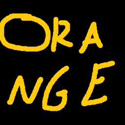

# Orange Text Features

Orange Text features is a Minecraft mod that allows the player to easily type in orange text on the server MCC Island.

---

## ✨ Features
MCC Island has a feature where wrapping your message in asterisks turns it orange and removes the colon after your name.
This mod allows you to turn on "Orange Mode" and text in orange, applying the asterisks for you!  

There is an additional feature to automatically start chat with a synonym of "says" (from a configurable list) because 
MCC Island removes the colon after your name. 

### Clickable Button Above Chat

- Can toggle Orange Mode on and off
- Doesn't conflict with the popular MCC Island Mod Trident
- Shows CMD if you're typing a command

### Advanced Hotkeys

- Supports Modifier + Key (like Ctrl + /)
- Configurable context (you choose whether the hotkey affects gameplay, chat, and gui)

### Commands

/orangetext enable   
/orangetext disable  
to turn Orange Mode on and off without a hotkey or the config menu

/orangetext openconfig   
to open the config menu if Mod Menu isn't installed

/orangetext reload   
to reload the config if you've changed something there and you don't want to open and close the game

## 💻 Installation
To install the mod simply download the latest release jar from [Modrinth](https://modrinth.com/mod/orange-text-features)!
Don't forget the mod's dependencies:
- [Fabric API](https://modrinth.com/mod/fabric-api)
- [Cloth Config API](https://modrinth.com/mod/cloth-config)

Additionally, this mod's config neatly integrates with [Mod Menu](https://modrinth.com/mod/modmenu)

## 📬 Reporting Issues

Please report any issues or bugs you encounter to the [issue tracker](https://github.com/Mushroomified/mcci_orange_text/issues)!
I would try to fix them as quickly as possible. If you have any feature requests from me, anything that could improve your experience, report it there too!
I intend on maintaining this mod and make it very easy and accesible to type in orange on MCC Island!

## 🛠️ Building from sources

Orange Text Features uses the [Gradle build tool](https://gradle.org/) and can be built with the `gradle build` command. The build
artifacts (production binaries and their source bundles) can be found in the `build/libs` directory.

### Build Requirements

- OpenJDK 25
    - I used the [Eclipse Temurin](https://adoptium.net/) distribution 
- Gradle 9.5.1
    - That is the version of Gradle I used, and I have not tested others.
    - To be completely honest I'm not too well versed in these stuff, the fabric example template did wonders.

## 📜 License

This project is available under the **MIT License**. See the [LICENSE](LICENSE) file for more details. Feel free to include this mod in any modpacks!